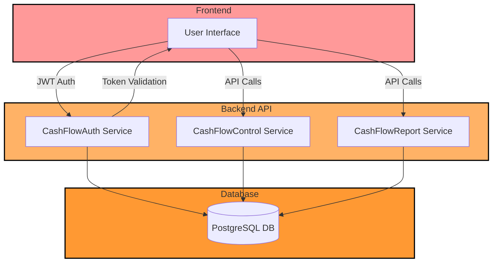
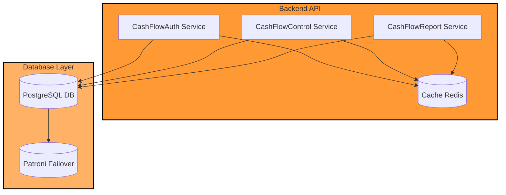
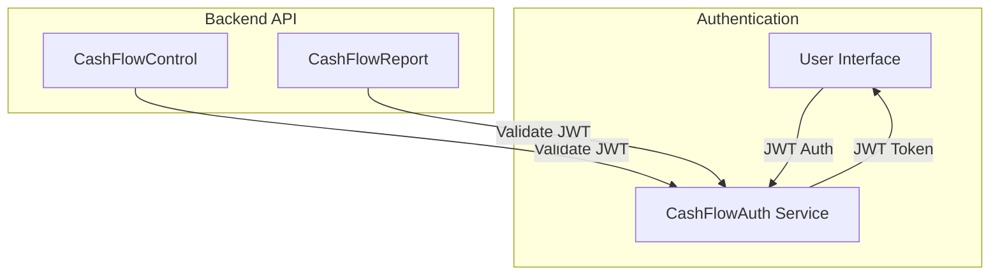
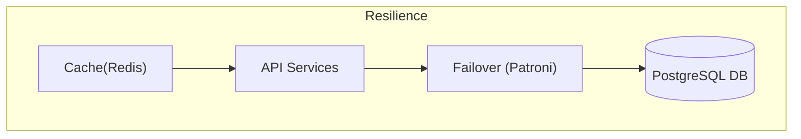
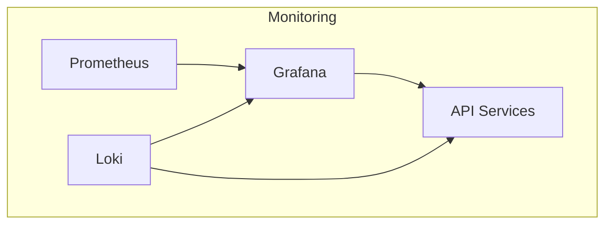
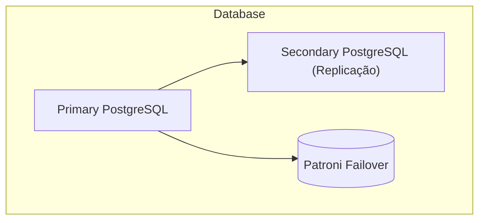
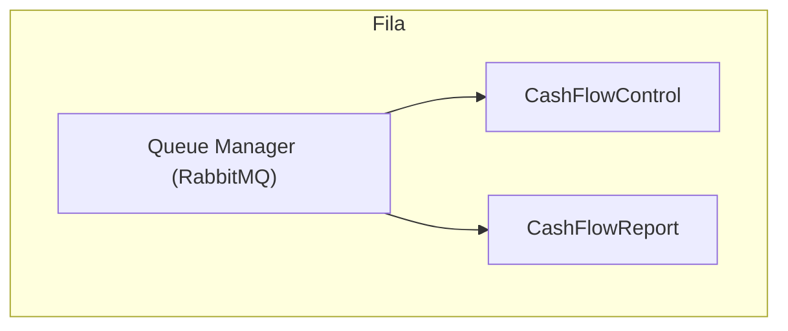

<p align="center">
  <a href="https://github.com/henriquechamizo/cashflow" target="blank"></a>
</p>

<p align="center">Uma aplicação eficiente e escalável para gestão de fluxo de caixa.</p>

<p align="center">
  <a href="https://github.com/henriquechamizo/cashflow" target="_blank"></a>
  <a href="https://github.com/henriquechamizo/cashflow" target="_blank"></a>
  <a href="https://github.com/henriquechamizo/cashflow" target="_blank"></a>
  <a href="https://github.com/henriquechamizo/cashflow" target="_blank"></a>
  <a href="https://github.com/henriquechamizo/cashflow" target="_blank"></a>
  <a href="https://github.com/henriquechamizo/cashflow" target="_blank"></a>
  <a href="https://github.com/henriquechamizo/cashflow" target="_blank"></a>
  <a href="https://github.com/henriquechamizo/cashflow" target="_blank"></a>
  <a href="https://github.com/henriquechamizo/cashflow" target="_blank"></a>
  <a href="https://github.com/henriquechamizo/cashflow" target="_blank"></a>
  <a href="https://github.com/henriquechamizo/cashflow" target="_blank"></a>
  <a href="https://github.com/henriquechamizo/cashflow" target="_blank"></a>
  <a href="https://github.com/henriquechamizo/cashflow" target="_blank"></a>
</p>

# CashFlow Application 🚀

## Documentação 📚

Nesta seção, apresentamos a arquitetura atual e a arquitetura desejada do sistema, juntamente com diagramas visuais que ajudam a entender o fluxo e o design das soluções propostas para escalabilidade, resiliência e segurança.

### Arquitetura Atual

#### Explicação:
Esse diagrama ilustra a arquitetura atual da aplicação **CashFlow**, onde o **Frontend** interage com os serviços **Backend** por meio de autenticação JWT, e os serviços se comunicam com o banco de dados PostgreSQL. Os três principais serviços são:
- **CashFlowAuth**: Responsável pela autenticação.
- **CashFlowControl**: Gerenciamento de transações financeiras.
- **CashFlowReport**: Geração de relatórios.

---
### Arquitetura Desejada

#### Diagrama de Arquitetura Microserviços


#### Explicação:
Esse diagrama representa a **arquitetura desejada** para escalabilidade e resiliência do sistema. Ele mostra o uso de **Redis** como cache distribuído para melhorar o desempenho e reduzir a carga no banco de dados. Além disso, o **Patroni** foi incluído para gerenciar o **failover** do banco de dados, garantindo a alta disponibilidade.

Para mais detalhes, veja o arquivo: [`microservices-architecture.md`](./docs/microservices-architecture.md)

---

#### Diagrama de Fluxo de Autenticação


#### Explicação:
Este diagrama mostra o processo de geração e validação dos tokens **JWT**. O **CashFlowAuth** emite os tokens para o frontend após a autenticação, e os outros serviços **CashFlowControl** e **CashFlowReport** validam esses tokens antes de permitir o acesso às APIs.

Para mais detalhes, veja o arquivo: [`authentication-flow.md`](./docs/authentication-flow.md)

---

#### Diagrama de Resiliência (Cache e Failover)


#### Explicação:
Aqui, mostramos como a resiliência pode ser alcançada por meio de mecanismos de **cache** e **failover**. O cache **Redis** ajuda a diminuir a carga no banco de dados, enquanto o **Patroni** gerencia o failover do banco de dados PostgreSQL, garantindo que o sistema permaneça disponível em caso de falhas.

Para mais detalhes, veja o arquivo: [`resilience-diagram.md`](./docs/resilience-diagram.md)

---

#### Diagrama de Monitoramento e Métricas


#### Explicação:
Esse diagrama detalha como o sistema de **monitoramento** é configurado utilizando **Prometheus** para captura de métricas, **Grafana** para visualização e **Loki** para captura de logs. Essa configuração permite que os administradores monitorem a saúde do sistema e diagnostiquem possíveis problemas.

Para mais detalhes, veja o arquivo: [`monitoring-metrics.md`](./docs/monitoring-metrics.md)

---

#### Diagrama de Failover com Replicação de Banco de Dados


#### Explicação:
Este diagrama descreve a **replicação do banco de dados** PostgreSQL, onde uma instância secundária recebe réplicas contínuas da primária. O **Patroni** gerencia o failover, permitindo que o sistema continue funcionando no caso de uma falha na instância principal.

Para mais detalhes, veja o arquivo: [`database-failover.md`](./docs/database-failover.md)

---


#### Diagrama de Estratégia de Desacoplamento de Serviços


#### Explicação:
Este diagrama mostra como o **RabbitMQ** é usado para desacoplar a comunicação entre os serviços, garantindo que um serviço não seja diretamente afetado pela falha de outro, melhorando assim a resiliência do sistema.

Para mais detalhes, veja o arquivo: [`service-decoupling.md`](./docs/service-decoupling.md)

---


## Requisitos Mínimos ⚙️ 
- [Docker](https://www.docker.com/)
- [Docker Compose](https://docs.docker.com/compose/)
- [Dotnet Core](https://dotnet.microsoft.com/) (Somente para rodar a aplicação localmente, sem Docker)

---

## Instalação 🛠️

Existem dois arquivos `docker-compose` para diferentes finalidades:

### 🌐 **Ambiente (Local)**
- Arquivo: `docker-compose.environment.yml`
- Comando para iniciar:
    ```bash
    docker compose -f docker-compose.environment.yml up -d
    ```
- **Containers:** 
    - Prometheus (Porta: 9090)
    - Grafana (Porta: 3000)
    - Postgres (Porta: 5432)

### 🏭 **Produção (Build da Aplicação)**
- Arquivo: `docker-compose.production.yml`
- Comando para iniciar:
    ```bash
    docker compose -f docker-compose.production.yml up -d --build
    ```
- **Containers:**
    - CashFlowAuth (Porta: 5135)
    - CashFlowReport (Porta: 5132)
    - CashFlowControl (Porta: 5123)

### 🗂️ **Executar Migrations**
Para rodar os **migrations** do projeto `CashFlowControl`:

- Na raiz do projeto, execute o script de migração:
    ```bash
    ./scripts/migration.sh
    ```

### 🌍 **Comando Completo**
Criar ambiente, build dos projetos e executar os migrations em sequência:
```bash
docker compose -f docker-compose.environment.yml up -d --build && docker compose -f docker-compose.production.yml up -d --build && ./scripts/migration.sh
```

### ⚠️ **Limpeza de Docker (Resolução de conflitos)**
Se houver conflitos de porta, rede, volumes ou problemas relacionados ao Docker:

- **ATENÇÃO:** Esse comando **resetará** o Docker instalado!
    ```bash
    docker stop $(docker ps -aq) && docker rm $(docker ps -aq) && docker rmi $(docker images -q) && docker volume prune && docker system prune -a --volumes
    ```

---

## Rodando Localmente (Sem Docker) 🖥️

Para rodar a aplicação localmente, configure a *connection string* do banco de dados no `appsettings` dos projetos: **CashFlowControl** e **CashFlowReport**.

Comandos:
- **CashFlowAuth** (Porta: 5135): 
    ```bash
    dotnet run --project ./CashFlowAuth/CashFlowAuth.csproj
    ```
- **CashFlowControl** (Porta: 5123): 
    ```bash
    dotnet run --project ./CashFlowControl/CashFlowControl.csproj
    ```
- **CashFlowReport** (Porta: 5209): 
    ```bash
    dotnet run --project ./CashFlowReport/CashFlowReport.csproj
    ```

---

## Projetos 📂

### 🔑 **CashFlowAuth**
- Responsável pela autenticação de usuários e geração de token JWT.
- **TODO:** Atualizar para validação de usuários no banco de dados com criptografia de senha e permissões por rota.

### 📊 **CashFlowControl**
- Controle de transações. JWT necessário para acessar.
- **TODO:** Criar rota `/health` para verificar versão e funcionamento do serviço.

### 📑 **CashFlowReport**
- Geração de relatórios. JWT necessário para acessar.
- **TODO:** Adicionar rota `/health` e opção de geração de relatórios em Excel/Word.

### 💾 **CashFlowInfra**
- Contém código compartilhado entre os sistemas de Controle e Relatório.
- **TODO:** Criar modelos de usuários, acessos e permissões para melhorar o serviço de autenticação.


---

## Swagger e Postman 📋

### **Documentação da API com Swagger**
O **Swagger** foi configurado para gerar automaticamente a documentação da API e permitir a interação com os endpoints protegidos por autenticação JWT.

#### **Acessar o Swagger:**
- **Importante:** O Swagger está disponível apenas em **ambientes de desenvolvimento**. Ele não será exibido quando a aplicação estiver rodando em **produção**.
  
  URLs do Swagger em ambiente de desenvolvimento:
  - **CashFlowAuth**: `http://localhost:5135/swagger`
  - **CashFlowControl**: `http://localhost:5123/swagger`
  - **CashFlowReport**: `http://localhost:5209/swagger`

#### **Autenticação via JWT no Swagger:**
1. Gere o token JWT através do serviço de autenticação (**CashFlowAuth**).
2. No Swagger, clique em **Authorize** no topo da página.
3. Insira o token no seguinte formato:
   ```
   Bearer <seu_token_jwt>
   ```

### **Coleção do Postman**
Para facilitar o teste e interação com os endpoints da aplicação, você pode importar uma **coleção do Postman** que já contém as rotas configuradas, incluindo a autenticação JWT.

#### **Importar Coleção do Postman:**
1. Baixe e importe a coleção JSON no Postman:
   - [CashFlow Postman Collection](./docs/postman-collection.json)
2. Edite a variável de ambiente **JWT** no Postman para incluir o token de autenticação, ou gere um novo token via **CashFlowAuth**.
3. Execute as requisições diretamente pelo Postman.

---

## Logs e Monitoramento 📈

### **Application Insights**
- Ferramenta robusta de monitoramento para ambientes produtivos (ou outros, se necessário). 
- Para habilitar, insira as chaves de configuração geradas no Azure.
- [Documentação do Application Insights](https://learn.microsoft.com/pt-br/azure/azure-monitor/app/app-insights-overview)

### **Prometheus**
- Armazena métricas de servidor e HTTP da aplicação. Configurações default podem ser modificadas no `Program.cs`.

### **Grafana**
- Visualiza métricas e dados de diversas fontes, facilitando a análise de erros e saúde da aplicação.

### **Configuração Grafana + Prometheus**
1. Inicie os containers:
    ```bash
    docker compose -f docker-compose.environment.yml up -d
    ```
2. Acesse o Grafana: [http://localhost:3000/login](http://localhost:3000/login)
   - **Login:** `admin` | **Senha:** `admin` (altere no primeiro acesso).
3. No Grafana, crie um novo Dashboard e adicione uma fonte de dados:
   - Selecione **Prometheus**.
   - Conexão: `http://prometheus:9090`
   - Teste e salve.
4. Crie as visualizações de métricas desejadas no Dashboard e salve.

---

## Testes 🧪

### Executar Testes Unitários:
- **Com cobertura:**
    ```bash
    dotnet test --collect:"XPlat Code Coverage" --settings coverlet.runsettings
    ```
- **Sem cobertura:**
    ```bash
    dotnet test
    ```

### Gerar Relatório Visual de Cobertura:
1. Gere o relatório:
    ```bash
    reportgenerator -reports:"TestResults/*/coverage.cobertura.xml" -targetdir:"coveragereport" -reporttypes:Html
    ```
2. Abra o arquivo gerado no navegador:
    ```bash
    open coveragereport/index.html
    ```

### Comando Completo:
```bash
rm -rf TestResults coveragereport && dotnet test --collect:"XPlat Code Coverage" --settings coverlet.runsettings && reportgenerator -reports:"TestResults/*/coverage.cobertura.xml" -targetdir:"coveragereport" -reporttypes:Html && open coveragereport/index.html
```

---

## FAQ ❓
- **Como solucionar conflitos de porta ou rede?**
  Utilize o comando de limpeza de Docker mencionado na seção de **Instalação**.

- **Como configurar os logs em produção?**
  Configure o Application Insights inserindo as chaves de configuração no `appsettings` do projeto.

---